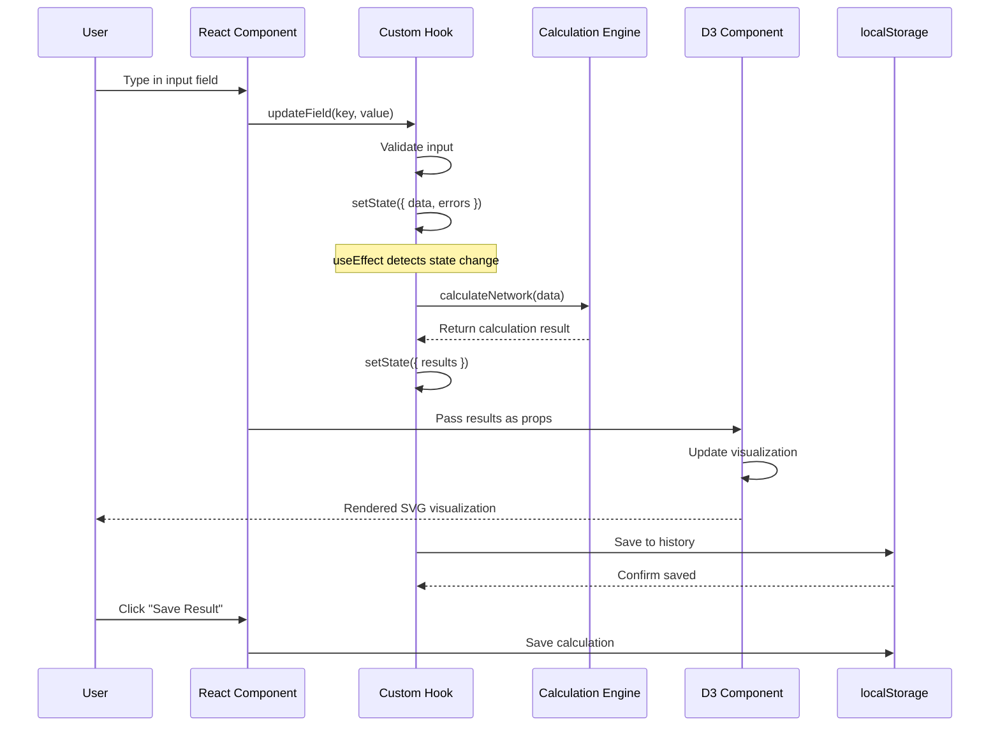

# Architecture: Network Utilities Suite (React + D3.js)

## 1. Directory Structure

The utilities are organized to maximize reuse, maintainability, and clear separation between Astro static generation, React interactivity, and D3 visualizations.

```bash
openether/src/
├── pages/
│   └── tools/
│       ├── index.astro              # Tools landing page (Astro)
│       ├── subnet-calculator.astro  # Subnet calculator (React island)
│       ├── bgp-parser.astro         # BGP path parser (React island)
│       ├── vlsm-allocator.astro     # VLSM allocator (React island)
│       └── ospf-calculator.astro    # OSPF cost calculator (React island)
│
├── components/
│   └── tools/
│       ├── common/                  # Shared React components
│       │   ├── inputs/              # Input fields (IP, CIDR, etc.)
│       │   ├── display/             # Result cards, info panels
│       │   └── visualizations/      # D3-based visualization wrappers
│       ├── subnet/                  # Subnet-specific React components
│       ├── bgp/                     # BGP-specific React components
│       ├── vlsm/                    # VLSM-specific React components
│       └── ospf/                    # OSPF-specific React components
│
├── lib/                             # Core calculation logic (pure TypeScript)
│   └── network/
│       ├── ipv4.ts                  # IPv4 calculation engine
│       ├── ipv6.ts                  # IPv6 calculation engine
│       ├── bgp.ts                   # BGP parsing engine
│       ├── vlsm.ts                  # VLSM allocation algorithm
│       ├── ospf.ts                  # OSPF cost calculations
│       ├── types.ts                 # Shared TypeScript interfaces
│       └── validators.ts            # Input validation logic
│
├── hooks/                           # React custom hooks
│   ├── useFormState.ts              # Form state management
│   ├── useCalculationResults.ts     # Calculation result state
│   ├── useCalculationHistory.ts     # localStorage history management
│   └── useD3Visualization.ts        # D3.js initialization and updates
│
├── utils/                           # Utility functions
│   ├── binary.ts                    # Binary conversion helpers
│   ├── formatters.ts                # Display formatters
│   └── ip-utils.ts                  # IP address manipulation
│
└── styles/
    └── tool-customizations.css      # Tool-specific Tailwind customizations
```

## 2. Component Architecture (React + D3.js)

We use a **layered architecture** with clear separation between state management, calculation logic, and visual presentation.

### Component Types

#### A. Smart Components (Container)
- Manage state, orchestrate data flow
- Handle user interactions and side effects
- Connect calculation engines to presentation layer
- **Examples**: `SubnetCalculatorApp.tsx`, `BGPParserApp.tsx`

```typescript
// Smart component structure
const SubnetCalculatorApp: React.FC = () => {
  const [formData, setFormData] = useState<FormData>(...);
  const [results, setResults] = useState<CalculationResult | null>(null);
  const [history, setHistory] = useLocalStorage<CalculationResult[]>('subnet-history', []);
  
  // Handle calculations
  const handleCalculate = useCallback((data: FormData) => {
    const result = IPv4Calculator.calculate(data.ip, data.cidr);
    setResults(result);
    setHistory(prev => [result, ...prev.slice(0, 49)]); // Keep last 50
  }, []);
  
  return (
    <CalculatorLayout>
      <InputForm onSubmit={handleCalculate} />
      {results && <ResultsPanel data={results} />}
      <HistoryPanel entries={history} />
    </CalculatorLayout>
  );
};
```

#### B. Presentational Components (UI)
- Pure UI, receive data via props
- No state management or side effects
- Highly reusable across different tools
- **Examples**: `InputField.tsx`, `ResultsCard.tsx`, `Button.tsx`

```typescript
// Presentational component
interface ResultsCardProps {
  networkAddress: string;
  broadcastAddress: string;
  usableHosts: number;
}

const NetworkInfoCard: React.FC<ResultsCardProps> = ({ 
  networkAddress, 
  broadcastAddress,
  usableHosts 
}) => (
  <Card>
    <h3 className="text-lg font-semibold mb-4">Network Information</h3>
    <DataRow label="Network" value={networkAddress} />
    <DataRow label="Broadcast" value={broadcastAddress} />
    <DataRow label="Usable Hosts" value={usableHosts.toLocaleString()} />
  </Card>
);
```

#### C. Visualization Components (D3.js)
- React wrappers around D3 visualizations
- Use `useEffect` and `useRef` for D3 integration
- Handle data updates with D3's enter/update/exit pattern
- **Examples**: `BinaryOctetGrid.tsx`, `ASPathGraph.tsx`, `SubnetChart.tsx`

```typescript
// D3 visualization wrapper
const BinaryOctetGrid: React.FC<BinaryGridProps> = ({ ipAddress, cidr }) => {
  const svgRef = useRef<SVGSVGElement>(null);
  const [dimensions, setDimensions] = useState({ width: 800, height: 200 });
  
  // D3 initialization
  useEffect(() => {
    if (!svgRef.current) return;
    
    const svg = d3.select(svgRef.current);
    const binaryGrid = new BinaryGrid(svg, dimensions);
    
    return () => {
      binaryGrid.destroy();
    };
  }, []);
  
  // Update when data changes
  useEffect(() => {
    if (!svgRef.current) return;
    
    const binaryGrid = BinaryGrid.getInstance(svgRef.current);
    binaryGrid.update(ipAddress, cidr);
  }, [ipAddress, cidr, dimensions]);
  
  return (
    <div className="visualization-container">
      <svg ref={svgRef} width={dimensions.width} height={dimensions.height} />
    </div>
  );
};
```

### Logic Layer (`src/lib/network/`)

Pure TypeScript classes with **zero dependencies** on React or D3. This ensures:
- **Testability**: 100% unit test coverage without DOM concerns
- **Reusability**: Can be used in Node.js scripts, web workers, or other environments
- **Performance**: No framework overhead in calculations
- **Maintainability**: Clear separation between calculation and presentation

```typescript
// Pure TypeScript calculation engine
export class IPv4Calculator {
  static calculate(ip: string, cidr: number): IPv4NetworkResult {
    // Parse IP to 32-bit integer
    const ipInt = IPv4Calculator.ipToInt(ip);
    
    // Calculate subnet mask
    const mask = (0xFFFFFFFF << (32 - cidr)) >>> 0;
    
    // Calculate network and broadcast addresses
    const network = ipInt & mask;
    const broadcast = network | ~mask;
    
    // Calculate host ranges
    const firstUsable = cidr <= 30 ? network + 1 : network;
    const lastUsable = cidr <= 30 ? broadcast - 1 : broadcast;
    const usableHosts = cidr <= 30 ? (1 << (32 - cidr)) - 2 : 1 << (32 - cidr);
    
    return {
      networkAddress: IPv4Calculator.intToIp(network),
      broadcastAddress: IPv4Calculator.intToIp(broadcast),
      subnetMask: IPv4Calculator.intToIp(mask),
      firstUsableHost: IPv4Calculator.intToIp(firstUsable),
      lastUsableHost: IPv4Calculator.intToIp(lastUsable),
      totalUsableHosts: usableHosts,
      cidr: cidr,
      binaryRepresentation: IPv4Calculator.toBinary(network, cidr)
    };
  }
  
  private static ipToInt(ip: string): number {
    return ip.split('.').reduce((acc, octet) => 
      (acc << 8) + parseInt(octet, 10), 0
    ) >>> 0;
  }
  
  private static intToIp(int: number): string {
    return [
      (int >>> 24) & 0xFF,
      (int >>> 16) & 0xFF,
      (int >>> 8) & 0xFF,
      int & 0xFF
    ].join('.');
  }
  
  private static toBinary(ipInt: number, cidr: number): string {
    const binary = ipInt.toString(2).padStart(32, '0');
    const networkBits = binary.substring(0, cidr);
    const hostBits = binary.substring(cidr);
    return `${networkBits}<span class="host-bits">${hostBits}</span>`;
  }
}
```

### State Management (React Hooks)

We use React's built-in hooks for state management, avoiding external state libraries to maintain simplicity.

#### Custom Hooks Pattern

```typescript
// src/hooks/useFormState.ts
export interface FormState<T> {
  data: T;
  errors: Partial<Record<keyof T, string>>;
  isValid: boolean;
  isSubmitting: boolean;
}

export const useFormState = <T extends Record<string, any>>(
  initialData: T,
  validator: (data: T) => Partial<Record<keyof T, string>>
) => {
  const [state, setState] = useState<FormState<T>>({
    data: initialData,
    errors: {},
    isValid: false,
    isSubmitting: false
  });
  
  // Validate on change
  useEffect(() => {
    const errors = validator(state.data);
    const isValid = Object.keys(errors).length === 0;
    setState(prev => ({ ...prev, errors, isValid }));
  }, [state.data, validator]);
  
  // Update handlers
  const updateField = useCallback(<K extends keyof T>(key: K, value: T[K]) => {
    setState(prev => ({
      ...prev,
      data: { ...prev.data, [key]: value }
    }));
  }, []);
  
  return { state, updateField, setState };
};

// Usage in component
const SubnetForm = () => {
  const { state, updateField } = useFormState({
    ipAddress: '',
    cidr: 24
  }, validateSubnetForm);
  
  return (
    <InputField
      label="IP Address"
      value={state.data.ipAddress}
      onChange={value => updateField('ipAddress', value)}
      error={state.errors.ipAddress}
    />
  );
};
```

## 3. D3.js Integration Architecture

### React-D3 Pattern

All D3 visualizations follow a consistent integration pattern:

1. **Initialization**: Create D3 class instance in `useEffect` (mount)
2. **Updates**: Call update methods when React props change
3. **Cleanup**: Destroy D3 instance in cleanup function (unmount)
4. **Events**: D3 events call React callbacks via props

```typescript
// src/hooks/useD3Visualization.ts
export const useD3Visualization = <T>(
  svgRef: RefObject<SVGSVGElement>,
  VisualizationClass: new (svg: SVGSVGElement, props: T) => D3Visualization<T>,
  props: T
) => {
  const instanceRef = useRef<D3Visualization<T> | null>(null);
  
  // Initialize on mount
  useEffect(() => {
    if (!svgRef.current) return;
    
    instanceRef.current = new VisualizationClass(svgRef.current, props);
    
    return () => {
      instanceRef.current?.destroy();
      instanceRef.current = null;
    };
  }, []);
  
  // Update when props change
  useEffect(() => {
    if (instanceRef.current) {
      instanceRef.current.update(props);
    }
  }, [props]);
  
  return instanceRef;
};
```

### D3 Visualization Base Class

```typescript
// Base class for all D3 visualizations
export abstract class D3Visualization<T> {
  protected svg: d3.Selection<SVGSVGElement, unknown, null, undefined>;
  protected g: d3.Selection<SVGGElement, unknown, null, undefined>;
  protected props: T;
  
  constructor(svgElement: SVGSVGElement, props: T) {
    this.svg = d3.select(svgElement);
    this.g = this.svg.append('g').attr('class', 'visualization-root');
    this.props = props;
    
    this.initialize();
    this.update(props);
  }
  
  protected abstract initialize(): void;
  
  public abstract update(props: T): void;
  
  public destroy(): void {
    this.svg.selectAll('*').remove();
  }
}
```

## 4. Data Flow Architecture

```mermaid
graph TB
    subgraph "User Interface Layer"
        UI[HTML Input Elements]
        Events[React Event Handlers]
    end
    
    subgraph "React State Layer"
        UseState[useState Hooks]
        UseMemo[useMemo Computations]
        UseCallback[useCallback Handlers]
        CustomHooks[Custom Hooks (useForm, useHistory)]
    end
    
    subgraph "Calculation Engine Layer"
        IPv4Calc[IPv4Calculator Class]
        IPv6Calc[IPv6Calculator Class]
        BGPParse[BGPParser Class]
        VLSMAlloc[VLSMAllocator Class]
    end
    
    subgraph "D3 Visualization Layer"
        D3Init[D3 Initialization]
        D3Update[D3 Update Pattern]
        D3Events[D3 Event Handlers]
        SVGRender[SVG Rendering]
    end
    
    subgraph "Storage Layer"
        localStorageAPI[localStorage API]
        Serialize[JSON Serialization]
    end
    
    %% Data flow
    UI --> Events
    Events --> UseState
    
    UseState --> CustomHooks
    CustomHooks --> UseMemo
    
    UseMemo --> IPv4Calc
    UseMemo --> IPv6Calc
    
    IPv4Calc --> UseState
    IPv6Calc --> UseState
    
    UseState --> D3Update
    
    D3Init --> SVGRender
    D3Update --> SVGRender
    D3Events --> Events
    
    UseState --> Serialize
    Serialize --> localStorageAPI
    
    localStorageAPI --> Serialize
    Serialize --> UseState
```

### State Flow



## 5. Error Handling Strategy

### Error Boundaries

```typescript
// Error boundary for tool containers
class ToolErrorBoundary extends Component<ToolErrorBoundaryProps, ToolErrorBoundaryState> {
  state = { hasError: false, error: null };
  
  static getDerivedStateFromError(error: Error) {
    return { hasError: true, error };
  }
  
  componentDidCatch(error: Error, errorInfo: ErrorInfo) {
    console.error('Tool error:', error, errorInfo);
  }
  
  render() {
    if (this.state.hasError) {
      return (
        <ErrorCard 
          title="Calculation Error"
          message={this.state.error?.message}
          onReset={() => this.setState({ hasError: false, error: null })}
        />
      );
    }
    
    return this.props.children;
  }
}
```

### Validation Strategy

```typescript
// Synchronous validation for immediate feedback
export const validateIP = (ip: string): string | null => {
  const ipv4Regex = /^(\d{1,3}\.){3}\d{1,3}$/;
  const ipv6Regex = /^([0-9a-fA-F]{0,4}:){7}[0-9a-fA-F]{0,4}$/;
  
  if (!ipv4Regex.test(ip) && !ipv6Regex.test(ip)) {
    return 'Invalid IP address format';
  }
  
  // Additional validation for IPv4 octets
  if (ipv4Regex.test(ip)) {
    const octets = ip.split('.').map(Number);
    if (octets.some(octet => octet < 0 || octet > 255)) {
      return 'IPv4 octets must be between 0-255';
    }
  }
  
  return null;
};

// Async validation for complex checks
export const validateNetwork = async (
  ip: string, 
  cidr: number
): Promise<ValidationResult> => {
  try {
    // Simulate API call for network conflict detection
    const result = await checkNetworkConflict(ip, cidr);
    
    if (result.hasConflict) {
      return { isValid: false, error: `Network conflicts with ${result.conflictingNetwork}` };
    }
    
    return { isValid: true };
  } catch (error) {
    return { isValid: false, error: 'Network validation failed' };
  }
};
```

## 6. Performance Optimization

### 1. Code Splitting by Tool

```typescript
// astro.config.mjs
export default defineConfig({
  integrations: [
    react({
      include: ['**/tools/**/*.astro'],
    }),
  ],
  vite: {
    build: {
      rollupOptions: {
        output: {
          manualChunks: {
            'react-vendor': ['react', 'react-dom'],
            'd3-vendor': ['d3'],
            'subnet-tool': ['./src/pages/tools/subnet-calculator.astro'],
            'bgp-tool': ['./src/pages/tools/bgp-parser.astro'],
            'vlsm-tool': ['./src/pages/tools/vlsm-allocator.astro'],
            'ospf-tool': ['./src/pages/tools/ospf-calculator.astro'],
          }
        }
      }
    }
  }
});
```

### 2. Memoization Strategy

```typescript
// Memoize expensive calculations
const SubnetCalculator: React.FC = () => {
  const [ip, setIp] = useState('');
  const [cidr, setCidr] = useState(24);
  
  // Expensive calculation - only re-run when inputs change
  const result = useMemo(() => {
    if (!validateIP(ip)) return null;
    return IPv4Calculator.calculate(ip, cidr);
  }, [ip, cidr]);
  
  // Memoize derived values
  const summary = useMemo(() => {
    if (!result) return null;
    return `${result.networkAddress}/${cidr} (${result.totalUsableHosts} hosts)`;
  }, [result, cidr]);
  
  return (
    <div>
      <InputForm ip={ip} cidr={cidr} onIpChange={setIp} onCidrChange={setCidr} />
      {result && <ResultsPanel data={result} summary={summary} />}
    </div>
  );
};
```

### 3. Web Workers for Heavy Calculations

```typescript
// src/lib/network/worker.ts
self.onmessage = async (event: MessageEvent) => {
  const { type, data } = event.data;
  
  switch (type) {
    case 'CALCULATE_VLSM':
      const result = await VLSMAllocator.allocate(data.network, data.requirements);
      self.postMessage({ type: 'VLSM_RESULT', result });
      break;
      
    case 'PARSE_BGP':
      const bgpResult = await BGPParser.parse(data.asPaths);
      self.postMessage({ type: 'BGP_RESULT', result: bgpResult });
      break;
  }
};

// Hook to use worker
export const useNetworkWorker = () => {
  const workerRef = useRef<Worker | null>(null);
  
  useEffect(() => {
    workerRef.current = new Worker(new URL('../lib/network/worker.ts', import.meta.url));
    
    return () => {
      workerRef.current?.terminate();
    };
  }, []);
  
  const calculateVLSM = useCallback((data: VLSMData) => {
    return new Promise<VLSMResult>((resolve) => {
      const handleMessage = (event: MessageEvent) => {
        if (event.data.type === 'VLSM_RESULT') {
          workerRef.current?.removeEventListener('message', handleMessage);
          resolve(event.data.result);
        }
      };
      
      workerRef.current?.addEventListener('message', handleMessage);
      workerRef.current?.postMessage({ type: 'CALCULATE_VLSM', data });
    });
  }, []);
  
  return { calculateVLSM };
};
```

## 7. Accessibility Architecture

### WCAG 2.1 AA Compliance

```typescript
// ARIA labels for interactive elements
const CIDRSlider: React.FC<CIDRSliderProps> = ({ value, onChange }) => (
  <div className="slider-container">
    <label htmlFor="cidr-slider" className="sr-only">
      CIDR Notation (network bits)
    </label>
    <input
      id="cidr-slider"
      type="range"
      min="1"
      max="30"
      value={value}
      onChange={onChange}
      aria-valuemin={1}
      aria-valuemax={30}
      aria-valuenow={value}
      aria-describedby="cidr-help-text"
    />
    <span id="cidr-help-text" className="help-text">
      /{value} = {Math.pow(2, 32 - value)} total addresses
    </span>
  </div>
);

// Keyboard navigation for D3 visualizations
class AccessibleBinaryGrid extends D3Visualization<BinaryGridProps> {
  protected initialize() {
    super.initialize();
    
    // Add keyboard navigation
    this.svg
      .attr('tabindex', '0')
      .on('keydown', (event: KeyboardEvent) => {
        switch (event.key) {
          case 'ArrowLeft':
            this.navigateBits(-1);
            break;
          case 'ArrowRight':
            this.navigateBits(1);
            break;
          case 'Enter':
            this.selectCurrentBit();
            break;
        }
      });
  }
  
  private navigateBits(direction: number) {
    // Implementation for keyboard navigation
  }
}
```

## 8. Testing Strategy

### Unit Tests (Calculation Engine)

```typescript
describe('IPv4Calculator', () => {
  describe('calculate', () => {
    it('should calculate /24 network correctly', () => {
      const result = IPv4Calculator.calculate('192.168.1.0', 24);
      
      expect(result.networkAddress).toBe('192.168.1.0');
      expect(result.broadcastAddress).toBe('192.168.1.255');
      expect(result.totalUsableHosts).toBe(254);
      expect(result.firstUsableHost).toBe('192.168.1.1');
      expect(result.lastUsableHost).toBe('192.168.1.254');
    });
    
    it('should handle /31 point-to-point links', () => {
      const result = IPv4Calculator.calculate('10.0.0.0', 31);
      
      expect(result.totalUsableHosts).toBe(2);
      expect(result.firstUsableHost).toBe('10.0.0.0');
      expect(result.lastUsableHost).toBe('10.0.0.1');
    });
  });
});
```

### Integration Tests (React + D3)

```typescript
describe('SubnetCalculator Integration', () => {
  it('should update visualization when input changes', async () => {
    render(<SubnetCalculatorApp />);
    
    const ipInput = screen.getByLabelText('IP Address');
    const cidrInput = screen.getByLabelText('CIDR');
    
    // Simulate user input
    fireEvent.change(ipInput, { target: { value: '192.168.1.0' } });
    fireEvent.change(cidrInput, { target: { value: '24' } });
    
    // Wait for calculation and visualization update
    await waitFor(() => {
      expect(screen.getByText('192.168.1.0')).toBeInTheDocument();
      expect(screen.getByText('192.168.1.255')).toBeInTheDocument();
    });
    
    // Verify D3 visualization rendered
    const svg = document.querySelector('svg');
    expect(svg).toBeInTheDocument();
    expect(svg.querySelectorAll('rect')).toHaveLength(32); // 32 bits
  });
});
```

### E2E Tests (Playwright)

```typescript
test('subnet calculator workflow', async ({ page }) => {
  await page.goto('/tools/subnet-calculator');
  
  // Fill form
  await page.fill('input[name="ip"]', '10.0.0.0');
  await page.fill('input[name="cidr"]', '16');
  
  // Submit
  await page.click('button[type="submit"]');
  
  // Verify results
  await expect(page.locator('text=10.0.0.0')).toBeVisible();
  await expect(page.locator('text=10.0.255.255')).toBeVisible();
  await expect(page.locator('text=65,534')).toBeVisible(); // Usable hosts
  
  // Verify D3 visualization
  const svg = page.locator('svg');
  await expect(svg).toBeVisible();
  
  // Test hover interaction
  await svg.hover();
  await expect(page.locator('.tooltip')).toBeVisible();
});
```

## 9. State Persistence

### localStorage Strategy

```typescript
// src/hooks/useLocalStorage.ts
export const useLocalStorage = <T>(
  key: string,
  initialValue: T
): [T, Dispatch<SetStateAction<T>>] => {
  const [storedValue, setStoredValue] = useState<T>(() => {
    try {
      const item = window.localStorage.getItem(key);
      return item ? JSON.parse(item) : initialValue;
    } catch (error) {
      console.error('Error reading from localStorage:', error);
      return initialValue;
    }
  });
  
  const setValue: Dispatch<SetStateAction<T>> = (value) => {
    try {
      setStoredValue(value);
      window.localStorage.setItem(key, JSON.stringify(value));
    } catch (error) {
      console.error('Error writing to localStorage:', error);
    }
  };
  
  return [storedValue, setValue];
};

// Usage in tool
const SubnetCalculator = () => {
  const [history, setHistory] = useLocalStorage<CalculationResult[]>(
    'subnet-calculator-history',
    []
  );
  
  const handleCalculate = useCallback((result: CalculationResult) => {
    setHistory(prev => [{
      ...result,
      timestamp: Date.now(),
      id: crypto.randomUUID()
    }, ...prev.slice(0, 49)]); // Keep last 50
  }, [setHistory]);
};
```

### URL Parameter Sharing

```typescript
// Share calculations via URL
const SubnetCalculator = () => {
  const [searchParams, setSearchParams] = useSearchParams();
  
  // Load from URL on mount
  useEffect(() => {
    const ip = searchParams.get('ip');
    const cidr = searchParams.get('cidr');
    
    if (ip && cidr) {
      handleCalculate({ ip, cidr: parseInt(cidr) });
    }
  }, [searchParams]);
  
  // Update URL when calculating
  const handleCalculate = useCallback((data: { ip: string, cidr: number }) => {
    setSearchParams({
      ip: data.ip,
      cidr: data.cidr.toString()
    });
    
    // ... perform calculation
  }, [setSearchParams]);
};
```

## 10. Retroactive Updates Required

Based on ADR-0003 approval, update the following documents:

- ✅ **ADR-0002**: Superseded by ADR-0003 (completed)
- ✅ **02_tools_architecture.md**: Updated to React + D3 (completed in this document)
- ⏳ **TASK-0600**: Update with React implementation details
- ⏳ **05_network_utilities_specification.md**: Update technology stack section
- ⏳ **documentation_guide.md**: Update JSDoc examples for React components

## 11. Related Documents

- **ADR-0003**: React + D3.js Technology Stack (Supersedes ADR-0002)
- **03_component_architecture_diagrams.md**: Component hierarchy and interactions
- **04_binary_visualization_architecture.md**: D3.js visualization specifications
- **05_network_utilities_specification.md**: Project scope and requirements
- **TASK-0600-subnet-calculator.md**: Subnet calculator implementation task

## 12. Summary

This architecture provides:
- **Clear separation** between calculation logic, React state, and D3 visualizations
- **Performance** through memoization, code splitting, and web workers
- **Maintainability** with pure TypeScript calculation engines and reusable components
- **Accessibility** with WCAG 2.1 AA compliance built-in
- **Testability** with comprehensive unit, integration, and E2E testing strategies
- **Scalability** to add new network tools following established patterns

The React + D3.js stack (per ADR-0003) provides the optimal balance of developer experience, visualization capabilities, and ecosystem support for the network utilities suite.
