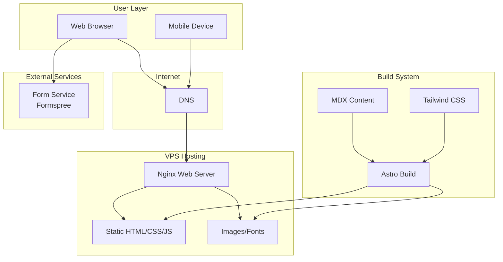
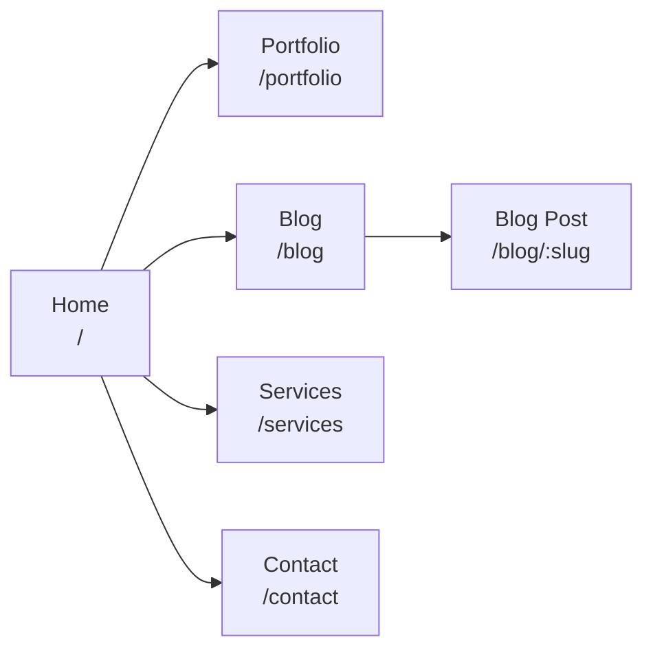
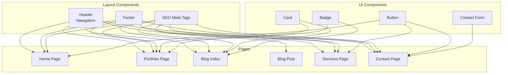
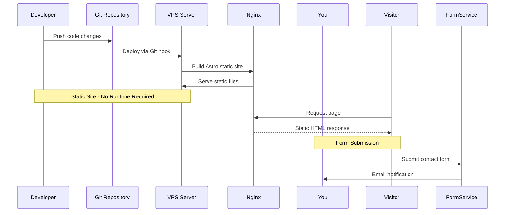

# OpenEther System Architecture

## High-Level Architecture

## Page Routes

## Component Hierarchy

## Deployment Flow

## Technology Stack Summary

| Layer | Technology | Purpose |
|-------|------------|---------|
| Framework | Astro 5.x | Static site generation |
| Styling | Tailwind CSS | Dark theme styling |
| Content | MDX | Blog posts in Markdown |
| Icons | Lucide | Lightweight icons |
| Fonts | Google Fonts | Inter font family |
| Hosting | VPS + Nginx | Static file serving |
| Forms | Formspree | Contact form handling |
