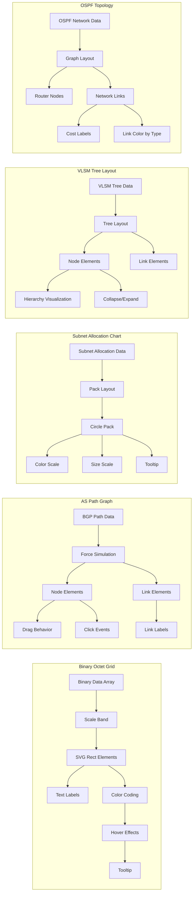
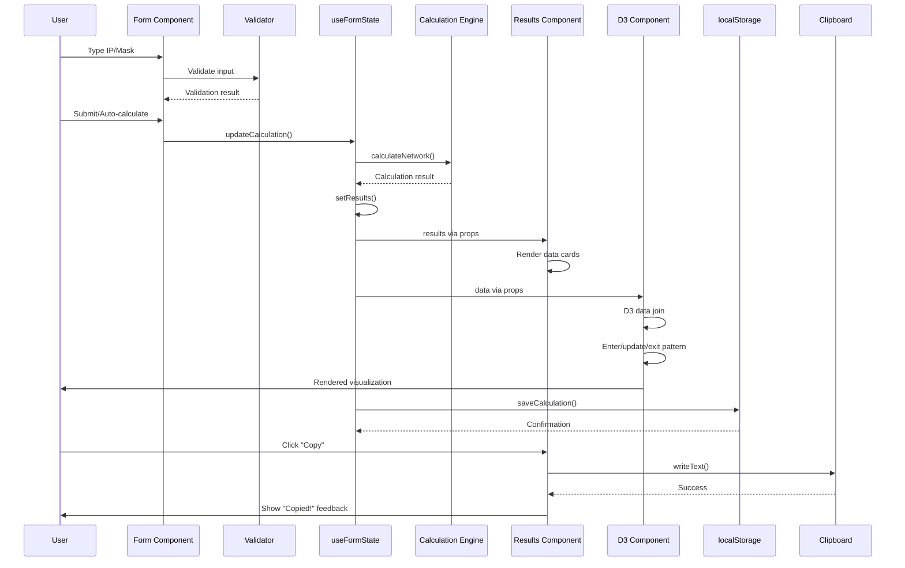
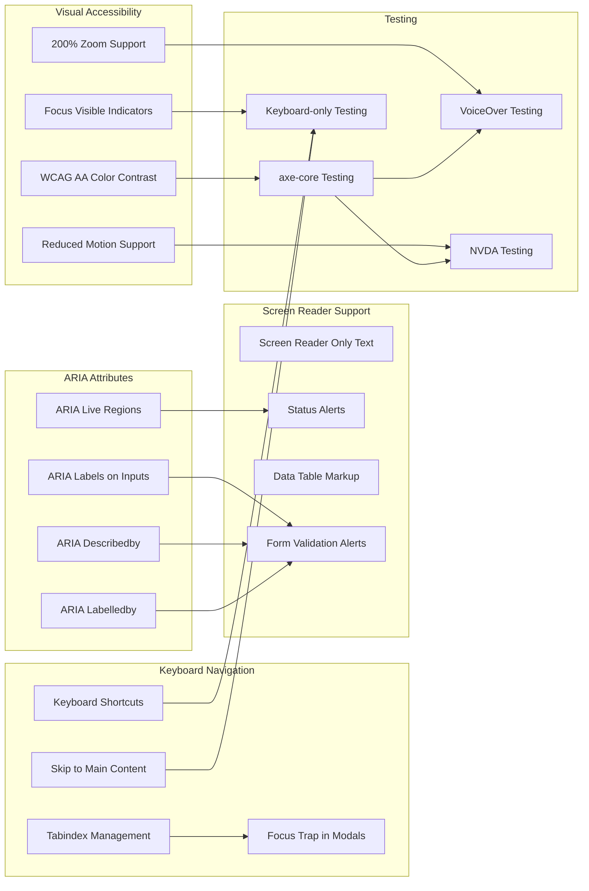

# Component Architecture: Network Utilities Suite

## System Overview

```mermaid
graph TB
    %% External Layer
    User[End User] --> Browser[Browser]
    Browser --> Astro[Astro Static Site]
    
    %% Astro Layer
    Astro --> ToolsIndex[Tools Landing Page]
    Astro --> SubnetPage[Subnet Calculator Page]
    Astro --> BGPPage[BGP Parser Page]
    Astro --> VLSMPage[VLSM Allocator Page]
    Astro --> OSPFPage[OSPF Calculator Page]
    
    %% React Application Layer
    SubnetPage --> SubnetApp[SubnetCalculator App]
    BGPPage --> BGPApp[BGP Parser App]
    VLSMPage --> VLSMApp[VLSM Allocator App]
    OSPFPage --> OSPFApp[OSPF Calculator App]
    
    %% Shared Components
    subgraph "Shared Component Library"
        IPInput[IP Input Component]
        CIDRSlider[CIDR Slider Component]
        ResultsCard[Results Card Component]
        HistoryPanel[History Panel]
    end
    
    %% D3 Visualizations
    subgraph "D3 Visualization Components"
        BinaryGrid[Binary Octet Grid]
        ASPathGraph[AS Path Graph]
        SubnetChart[Subnet Allocation Chart]
        OSPFTopology[OSPF Topology]
        VLSMTree[VLSM Tree Layout]
    end
    
    %% Calculation Engines
    subgraph "Network Calculation Engines"
        IPv4Calc[IPv4 Calculator]
        IPv6Calc[IPv6 Calculator]
        BGPParse[BGP Parser]
        VLSMAlloc[VLSM Allocator]
        OSPFCalc[OSPF Calculator]
    end
    
    %% Data Flow Connections
    SubnetApp --> IPInput
    SubnetApp --> CIDRSlider
    SubnetApp --> ResultsCard
    SubnetApp --> BinaryGrid
    SubnetApp --> IPv4Calc
    SubnetApp --> IPv6Calc
    SubnetApp --> HistoryPanel
    
    BGPApp --> IPInput
    BGPApp --> ResultsCard
    BGPApp --> ASPathGraph
    BGPApp --> BGPParse
    BGPApp --> HistoryPanel
    
    VLSMApp --> IPInput
    VLSMApp --> CIDRSlider
    VLSMApp --> ResultsCard
    VLSMApp --> VLSMTree
    VLSMApp --> SubnetChart
    VLSMApp --> VLSMAlloc
    VLSMApp --> HistoryPanel
    
    OSPFApp --> IPInput
    OSPFApp --> CIDRSlider
    OSPFApp --> ResultsCard
    OSPFApp --> OSPFTopology
    OSPFApp --> OSPFCalc
    OSPFApp --> HistoryPanel
    
    %% External Services
    Browser --> localStorage[(localStorage)]
    Browser --> Clipboard[(Clipboard API)]
    
    HistoryPanel --> localStorage
    ResultsCard --> Clipboard
```



## Component Hierarchy

```mermaid
graph TD
    subgraph "Page Level (Astro)"
        Page[astro/pages/tools/subnet.astro]
    end
    
    subgraph "Application Root (React)"
        App[SubnetCalculatorApp.tsx]
    end
    
    subgraph "Layout Components"
        Header[ToolHeader.tsx]
        Layout[CalculatorLayout.tsx]
        Footer[ToolFooter.tsx]
    end
    
    subgraph "Form Components"
        InputForm[InputForm.tsx]
        IPInput[IPInputField.tsx]
        CIDRSlider[CIDRSlider.tsx]
        SubmitButton[SubmitButton.tsx]
    end
    
    subgraph "Results Components"
        ResultsPanel[ResultsPanel.tsx]
        NetworkInfo[NetworkInfoCard.tsx]
        HostRange[HostRangeDisplay.tsx]
        BinaryToggle[BinaryToggleButton.tsx]
    end
    
    subgraph "Visualization Components (D3)"
        BinaryGrid[BinaryOctetGrid.tsx]
        SubnetPie[SubnetAllocationPie.tsx]
        HostChart[HostRangeChart.tsx]
    end
    
    subgraph "Utility Layer"
        IPv4Calc[IPv4Calculator.ts]
        IPv6Calc[IPv6Calculator.ts]
        BinaryFmt[BinaryFormatter.ts]
        Validation[InputValidator.ts]
    end
    
    subgraph "State Management"
        UseForm[useFormState custom hook]
        UseHistory[useCalculationHistory custom hook]
        UseResults[useCalculationResults custom hook]
    end
    
    subgraph "Data Layer"
        localStorage[(localStorage API)]
        Clipboard[(Clipboard API)]
    end
    
    %% Page to App
    Page --> App
    
    %% App structure
    App --> Header
    App --> Layout
    App --> Footer
    
    Layout --> InputForm
    Layout --> ResultsPanel
    
    InputForm --> IPInput
    InputForm --> CIDRSlider
    InputForm --> SubmitButton
    
    ResultsPanel --> NetworkInfo
    ResultsPanel --> HostRange
    ResultsPanel --> BinaryToggle
    ResultsPanel --> BinaryGrid
    ResultsPanel --> SubnetPie
    ResultsPanel --> HostChart
    
    %% State management
    App --> UseForm
    App --> UseHistory
    App --> UseResults
    
    UseForm --> Validation
    UseResults --> IPv4Calc
    UseResults --> IPv6Calc
    UseResults --> BinaryFmt
    
    UseHistory --> localStorage
    ResultsPanel --> Clipboard
```



## D3 Visualization Architecture



## State Management Flow



## Data Flow Architecture

```mermaid
graph TB
    subgraph "Input Layer"
        IPInput[IP Input Field]
        CIDRInput[CIDR Input Field]
        SubmitBtn[Submit Button]
        AutoCalc[Auto-calculate on change]
    end
    
    subgraph "Validation Layer"
        IPValidator[IP Format Validator]
        CIDRValidator[CIDR Range Validator]
        CompositeValidator[Composite Validator]
    end
    
    subgraph "State Layer"
        FormState[Form State (useState)]
        CalcState[Calculation State (useState)]
        HistoryState[History State (useState)]
        
        FormReducer[Form Reducer]
        CalcReducer[Calculation Reducer]
    end
    
    subgraph "Calculation Layer"
        IPv4Engine[IPv4 Calculation Engine]
        IPv6Engine[IPv6 Calculation Engine]
        ErrorHandler[Error Handler]
    end
    
    subgraph "Presentation Layer"
        NetworkCard[Network Info Card]
        HostRangeCard[Host Range Card]
        BinaryCard[Binary Representation Card]
        ErrorAlert[Error Alert]
    end
    
    subgraph "Visualization Layer"
        BinaryGrid[Binary Octet Grid]
        SubnetChart[Subnet Chart]
        HostChart[Host Range Chart]
    end
    
    subgraph "Storage Layer"
        localStorageAPI[localStorage API]
        Serialize[Serialize/Deserialize]
    end
    
    %% Input flow
    IPInput --> IPValidator
    CIDRInput --> CIDRValidator
    AutoCalc --> CompositeValidator
    SubmitBtn --> CompositeValidator
    
    IPValidator --> CompositeValidator
    CIDRValidator --> CompositeValidator
    
    %% Validation to state
    CompositeValidator --> FormState
    FormState --> FormReducer
    
    %% State to calculation
    FormReducer --> CalcReducer
    CalcReducer --> IPv4Engine
    CalcReducer --> IPv6Engine
    
    IPv4Engine --> ErrorHandler
    IPv6Engine --> ErrorHandler
    
    %% Calculation to state
    IPv4Engine --> CalcState
    IPv6Engine --> CalcState
    ErrorHandler --> CalcState
    
    %% State to presentation
    CalcState --> NetworkCard
    CalcState --> HostRangeCard
    CalcState --> BinaryCard
    CalcState --> ErrorAlert
    
    %% State to visualization
    CalcState --> BinaryGrid
    CalcState --> SubnetChart
    CalcState --> HostChart
    
    %% State to storage
    CalcState --> HistoryState
    HistoryState --> Serialize
    Serialize --> localStorageAPI
    
    %% Storage to state
    localStorageAPI --> Serialize
    Serialize --> HistoryState
    
    %% Error handling
    ErrorHandler --> ErrorAlert
```

## File Structure Map

```mermaid
graph TD
    Root[openether/src/]
    
    subgraph "Pages"
        Pages[pages/]
        ToolsDir[tools/]
        ToolsIndex[index.astro]
        SubnetPage[subnet-calculator.astro]
        BGPPage[bgp-parser.astro]
        VLSMPage[vlsm-allocator.astro]
        OSPFPage[ospf-calculator.astro]
    end
    
    subgraph "Components"
        Components[components/]
        ToolsComponents[tools/]
        SharedComponents[shared/]
        Inputs[inputs/]
        Display[display/]
        Viz[visualizations/]
    end
    
    subgraph "Lib (Calculation)"
        Lib[lib/]
        NetworkLib[network/]
        IPv4[ipv4.ts]
        IPv6[ipv6.ts]
        BGP[bgp.ts]
        VLSM[vlsm.ts]
        OSPF[ospf.ts]
        Types[types.ts]
        Validators[validators.ts]
    end
    
    subgraph "Hooks"
        Hooks[hooks/]
        UseForm[useFormState.ts]
        UseHistory[useCalculationHistory.ts]
        UseResults[useCalculationResults.ts]
    end
    
    subgraph "Utils"
        Utils[utils/]
        Formatters[formatters.ts]
        Binary[binary.ts]
        IPUtils[ip-utils.ts]
    end
    
    Root --> Pages
    Root --> Components
    Root --> Lib
    Root --> Hooks
    Root --> Utils
    
    Pages --> ToolsDir
    ToolsDir --> ToolsIndex
    ToolsDir --> SubnetPage
    ToolsDir --> BGPPage
    ToolsDir --> VLSMPage
    ToolsDir --> OSPFPage
    
    Components --> ToolsComponents
    Components --> SharedComponents
    
    SharedComponents --> Inputs
    SharedComponents --> Display
    SharedComponents --> Viz
    
    Lib --> NetworkLib
    NetworkLib --> IPv4
    NetworkLib --> IPv6
    NetworkLib --> BGP
    NetworkLib --> VLSM
    NetworkLib --> OSPF
    NetworkLib --> Types
    NetworkLib --> Validators
    
    Utils --> Formatters
    Utils --> Binary
    Utils --> IPUtils
```

## Performance Architecture

```mermaid
graph TB
    subgraph "Optimization Strategies"
        LazyLoad[React.lazy() Code Splitting]
        Memo[React.memo]
        UseMemo[useMemo]
        UseCallback[useCallback]
        TreeShake[D3 Tree Shaking]
        WebWorkers[Web Workers for Heavy Calculations]
    end
    
    subgraph "Lazy Loading by Route"
        SubnetChunk[Subnet Calculator Chunk]
        BGPChunk[BGP Parser Chunk]
        VLSMChunk[VLSM Allocator Chunk]
        OSPFChunk[OSPF Calculator Chunk]
        D3Chunk[D3 Components Chunk]
    end
    
    subgraph "Memoization Points"
        NetworkCalc[Network Calculation Memoization]
        BinaryConv[Binary Conversion Memoization]
        HostRange[Host Range Calc Memoization]
        SVGCache[SVG Element Caching]
    end
    
    subgraph "Bundle Splitting"
        VendorReact[React Vendor Bundle]
        VendorD3[D3 Vendor Bundle]
        MainApp[Main App Bundle]
        ToolBundles[Tool-specific Bundles]
    end
    
    %% Optimization flow
    LazyLoad --> SubnetChunk
    LazyLoad --> BGPChunk
    LazyLoad --> VLSMChunk
    LazyLoad --> OSPFChunk
    
    Memo --> NetworkCalc
    Memo --> BinaryConv
    Memo --> HostRange
    
    TreeShake --> D3Chunk
    D3Chunk --> SVGCache
    
    %% Bundle grouping
    VendorReact --> MainApp
    VendorD3 --> D3Chunk
    MainApp --> ToolBundles
    
    %% Web workers for heavy ops
    WebWorkers --> NetworkCalc
    WebWorkers --> VLSMChunk
    WebWorkers --> BGPChunk
```

## Accessibility Architecture



**Diagram Key**:
- **Astro Layer**: Static site generation and routing
- **React Layer**: Interactive application logic
- **D3 Layer**: Data visualizations and SVG manipulation
- **Calculation Layer**: Pure TypeScript business logic
- **Storage Layer**: Browser APIs (localStorage, Clipboard)

**Why This Architecture Works**:
1. **Separation of concerns**: Astro handles pages, React handles interactivity, D3 handles visualization
2. **Performance**: Lazy loading, memoization, and code splitting ensure fast load times
3. **Maintainability**: Clear boundaries between layers enable independent development
4. **Scalability**: New tools follow same pattern, reuse shared components
5. **Testability**: Each layer can be tested independently (unit tests for calculations, integration for React, E2E for full flow)
6. **Accessibility**: ARIA attributes and keyboard navigation built into component design
7. **User experience**: localStorage persistence, URL sharing, responsive design throughout