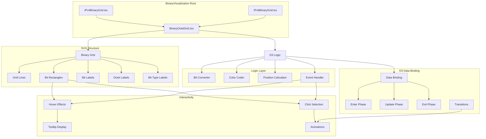
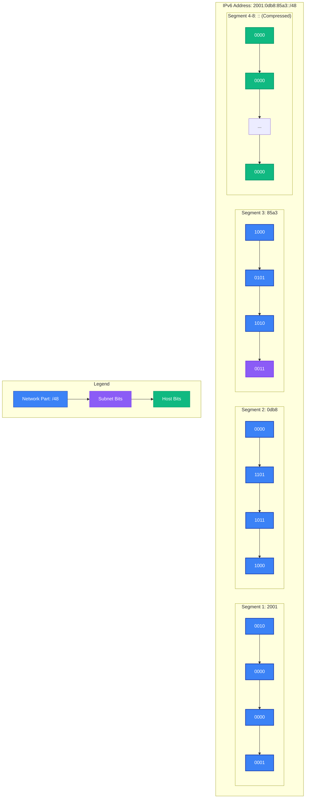
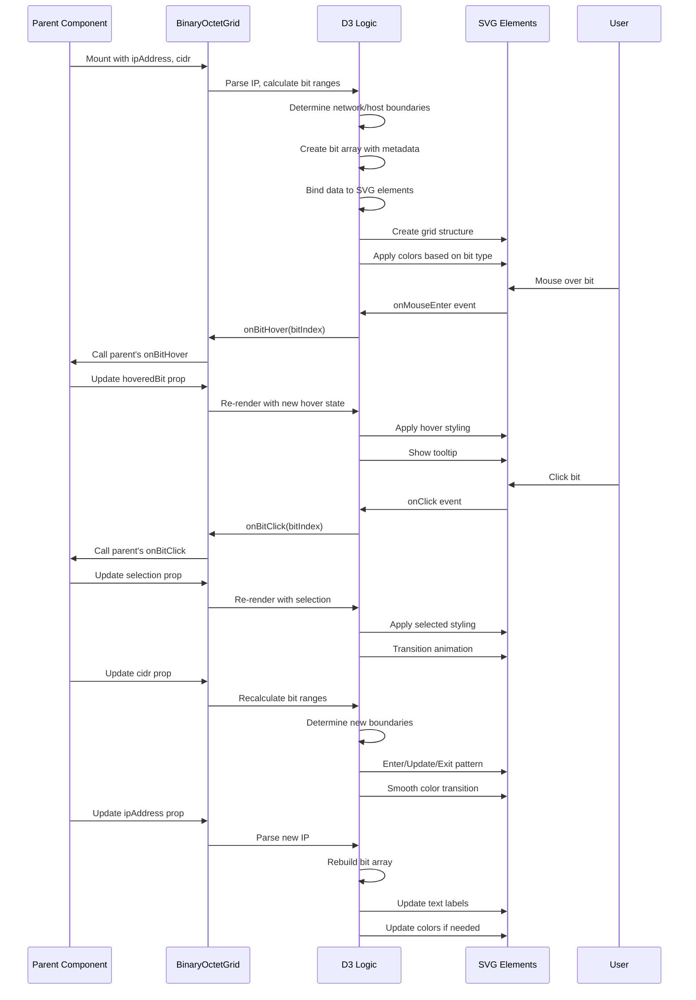

# Binary Visualization Component Architecture

## Overview

This document details the architecture for the interactive binary visualization components used across the network utilities suite. These components display IP addresses, subnet masks, and network/broadcast addresses as interactive binary grids with color coding for network/host bits.

## Core Components



## Visual Design

### IPv4 Binary Grid (32 bits)

```mermaid
graph LR
    subgraph "IPv4 Address: 192.168.1.0/24"
        
        subgraph "Octet 1: 192"
            N1[1] --> N2[1] --> N3[0] --> N4[0] --> N5[0] --> N6[0] --> N7[0] --> N8[0]
        end
        
        subgraph "Octet 2: 168"
            N9[1] --> N10[0] --> N11[1] --> N12[0] --> N13[1] --> N14[0] --> N15[0] --> N16[0]
        end
        
        subgraph "Octet 3: 1"
            N17[0] --> N18[0] --> N19[0] --> N20[0] --> N21[0] --> N22[0] --> N23[0] --> N24[1]
        end
        
        subgraph "Octet 4: 0"
            N25[0] --> N26[0] --> N27[0] --> N28[0] --> N29[0] --> N30[0] --> N31[0] --> N32[0]
        end
        
        %% CIDR /24 - first 24 bits are network
        classDef network fill:#3B82F6,stroke:#1E40AF,stroke-width:2px,color:#fff
        classDef host fill:#10B981,stroke:#059669,stroke-width:2px,color:#fff
        
        class N1,N2,N3,N4,N5,N6,N7,N8,N9,N10,N11,N12,N13,N14,N15,N16,N17,N18,N19,N20,N21,N22,N23,N24 network
        class N25,N26,N27,N28,N29,N30,N31,N32 host
    end
```



### Color Coding Scheme

| Bit Type | Color | Hex | Usage |
|----------|-------|-----|-------|
| Network | Blue | `#3B82F6` | Bits that identify the network |
| Host | Green | `#10B981` | Bits that identify hosts on the network |
| Subnet | Purple | `#8B5CF6` | For VLSM - identifies subnet bits |
| Overlap | Red | `#EF4444` | For conflict detection - overlapping bits |
| Selected | Yellow | `#F59E0B` | User-selected bits for interactions |
| Hover | Light gray | `#E5E7EB` | Hover state feedback |

### IPv6 Binary Grid (128 bits)



## Component Props

```typescript
interface BinaryOctetGridProps {
  /** IPv4 or IPv6 address as string */
  ipAddress: string;
  
  /** CIDR notation (e.g., 24 for /24) */
  cidr: number;
  
  /** Bit-level selection state */
  selection?: {
    start: number;
    end: number;
    type: 'network' | 'host' | 'subnet';
  };
  
  /** Hover state tracking */
  hoveredBit?: number;
  
  /** Click handler for bit interactions */
  onBitClick?: (bitIndex: number) => void;
  
  /** Hover handler */
  onBitHover?: (bitIndex: number | null) => void;
  
  /** Color scheme variant */
  colorScheme?: 'default' | 'high-contrast' | 'protanopia' | 'deuteranopia';
  
  /** Size variant */
  size?: 'small' | 'medium' | 'large';
  
  /** Show/hide additional info */
  showOctetLabels?: boolean;
  showBitLabels?: boolean;
  showTypeLabels?: boolean;
  
  /** Animation settings */
  animationEnabled?: boolean;
  animationDuration?: number;
  
  /** Accessibility */
  ariaLabel?: string;
  ariaDescribedBy?: string;
  
  /** Theme override */
  customColors?: {
    network: string;
    host: string;
    subnet: string;
    overlap: string;
    selected: string;
    hover: string;
  };
}
```

## Data Flow



## Implementation Details

### IPv4 Binary Grid Structure

```typescript
// Data structure for each bit
interface BitData {
  index: number;          // 0-31
  value: 0 | 1;           // Bit value
  octet: number;          // 1-4
  position: number;       // 1-8 within octet
  type: 'network' | 'host' | 'subnet';
  selected: boolean;
  label: string;          // "192" or "Network Bit"
}

// Octet grouping
interface OctetData {
  octet: number;
  bits: BitData[];
  label: string;          // "192" or "001"
}
```

### SVG Layout Calculation

```typescript
// Layout calculations (pixels)
interface BinaryGridLayout {
  bitWidth: number;        // Width of each bit square
  bitHeight: number;       // Height of each bit square
  bitSpacing: number;      // Space between bits
  octetSpacing: number;    // Space between octets
  labelOffset: number;     // Space for labels
  
  // Layout dimensions
  calculateWidth(bitsPerOctet: number, octets: number): number;
  calculateHeight(showLabels: boolean): number;
  
  // Position calculators
  getBitX(octet: number, position: number): number;
  getBitY(row: number): number;
  getOctetLabelX(octet: number): number;
  getBitLabelY(): number;
  
  // Hit detection
  getBitAtPosition(x: number, y: number): BitData | null;
}
```

### D3 Data Join Pattern

```typescript
class BinaryOctetGrid {
  private svg: d3.Selection<SVGSVGElement, unknown, null, undefined>;
  private bitsGroup: d3.Selection<SVGGElement, unknown, null, undefined>;
  private data: BitData[];
  private colorScale: d3.ScaleOrdinal<string, string>;
  
  render() {
    // DATA BINDING
    const bit = this.bitsGroup
      .selectAll<SVGGElement, BitData>('g.bit')
      .data(this.data, d => d.index);
    
    // ENTER
    const bitEnter = bit
      .enter()
      .append('g')
      .attr('class', 'bit')
      .attr('transform', d => this.getBitPosition(d));
    
    bitEnter
      .append('rect')
      .attr('width', this.layout.bitWidth)
      .attr('height', this.layout.bitHeight)
      .attr('rx', 2)  // Rounded corners
      .attr('fill', d => this.colorScale(d.type))
      .attr('stroke', '#374151')
      .attr('stroke-width', 1);
    
    bitEnter
      .append('text')
      .attr('x', this.layout.bitWidth / 2)
      .attr('y', this.layout.bitHeight / 2)
      .attr('text-anchor', 'middle')
      .attr('dominant-baseline', 'middle')
      .attr('font-family', 'monospace')
      .attr('font-size', '12px')
      .attr('fill', '#1F2937')
      .text(d => d.value);
    
    // UPDATE
    const bitUpdate = bitEnter.merge(bit);
    
    bitUpdate
      .transition()
      .duration(this.props.animationDuration || 300)
      .attr('transform', d => this.getBitPosition(d));
    
    bitUpdate
      .select('rect')
      .transition()
      .duration(this.props.animationDuration || 300)
      .attr('fill', d => {
        if (d.selected) return this.customColors.selected;
        if (d.hovered) return this.customColors.hover;
        return this.colorScale(d.type);
      });
    
    bitUpdate
      .select('text')
      .transition()
      .duration(this.props.animationDuration || 300)
      .text(d => d.value);
    
    // EXIT
    bit
      .exit()
      .transition()
      .duration(200)
      .style('opacity', 0)
      .remove();
    
    // EVENTS
    bitUpdate
      .on('mouseenter', (event, d) => {
        this.handleBitHover(d.index);
        this.showTooltip(event, d);
      })
      .on('mouseleave', () => {
        this.handleBitHover(null);
        this.hideTooltip();
      })
      .on('click', (event, d) => {
        this.handleBitClick(d.index);
      });
  }
}
```

## Interactive Features

### 1. Hover States

```typescript
// Hover behavior
handleBitHover(bitIndex: number | null) {
  // Update state
  this.setState({ hoveredBit: bitIndex });
  
  // Visual feedback
  d3.selectAll('g.bit')
    .select('rect')
    .attr('fill', d => {
      if (d.index === bitIndex) {
        return this.customColors.hover;
      }
      // Return to normal color if not hovered
      return this.getBitColor(d);
    });
}
```

### 2. Click Selection

```typescript
// Click selection with range support
handleBitClick(bitIndex: number) {
  const { selection } = this.state;
  
  if (!selection) {
    // First click - start selection
    this.setState({
      selection: {
        start: bitIndex,
        end: bitIndex,
        type: this.detectBitType(bitIndex)
      }
    });
  } else if (selection.start === bitIndex) {
    // Click same bit - toggle off
    this.setState({ selection: null });
  } else {
    // Second click - complete range
    const start = Math.min(selection.start, bitIndex);
    const end = Math.max(selection.start, bitIndex);
    
    this.setState({
      selection: {
        start,
        end,
        type: this.detectRangeType(start, end)
      }
    });
  }
}
```

### 3. Tooltip System

```typescript
// Tooltip with bit information
showTooltip(event: MouseEvent, bit: BitData) {
  const tooltip = d3.select('#binary-tooltip');
  
  tooltip
    .style('opacity', 1)
    .style('left', `${event.pageX + 10}px`)
    .style('top', `${event.pageY - 10}px`)
    .html(`
      <div class="tooltip-content">
        <strong>Bit ${bit.index}</strong><br/>
        Octet ${bit.octet}, Position ${bit.position}<br/>
        Value: <strong>${bit.value}</strong><br/>
        Type: <span style="color: ${this.colorScale(bit.type)}">${bit.type}</span><br/>
        ${bit.label ? `Decimal: ${bit.label}` : ''}
      </div>
    `);
}
```

### 4. CIDR Slider Integration

```typescript
// Update visualization when CIDR changes
componentDidUpdate(prevProps: BinaryOctetGridProps) {
  if (prevProps.cidr !== this.props.cidr) {
    // Recalculate bit types
    const newData = this.calculateBitTypes(this.props.ipAddress, this.props.cidr);
    
    // Update data binding
    this.data = newData;
    
    // Re-render with animation
    this.render();
  }
}
```

## Performance Optimizations

### 1. Memoization

```typescript
// Memoize expensive calculations
const calculateBitData = useMemo(() => {
  return ipString.split('').map((char, i) => {
    // Complex calculation here
    return {
      index: i,
      value: char === '1' ? 1 : 0,
      // ... other properties
    };
  });
}, [ipAddress, cidr]);
```

### 2. Virtualization for IPv6

```typescript
// For IPv6 (128 bits), render only visible octets
// Use intersection observer to render octets as they come into view
useVirtualization({
  itemCount: 16, // 16 octets for IPv6
  itemHeight: 40, // pixels per octet row
  overscan: 2, // render 2 extra octets
});
```

### 3. GPU Acceleration

```css
/* Use CSS transforms for smooth animations */
.binary-octet-grid {
  transform: translateZ(0);
  backface-visibility: hidden;
  perspective: 1000px;
}

.binary-bit {
  transition: fill 0.3s ease;
  will-change: fill;
}
```

## Accessibility Features

### 1. ARIA Labels

```typescript
// Screen reader support
<svg role="img" aria-labelledby="binary-title binary-desc">
  <title id="binary-title">Binary representation of 192.168.1.0/24</title>
  <desc id="binary-desc">
    32-bit binary view showing first 24 network bits in blue and 8 host bits in green
  </desc>
  
  <g class="bits" role="group" aria-label="Network and host bits">
    {data.map(bit => (
      <g
        key={bit.index}
        role="button"
        tabindex="0"
        aria-label={`Bit ${bit.index}, value ${bit.value}, ${bit.type}`}
        onKeyPress={this.handleBitKeyPress}
      >
        <rect ... />
        <text ...>{bit.value}</text>
      </g>
    ))}
  </g>
</svg>
```

### 2. Keyboard Navigation

```typescript
// Arrow key navigation
handleKeyDown(event: KeyboardEvent) {
  const { currentBit } = this.state;
  
  switch (event.key) {
    case 'ArrowRight':
      this.selectBit(Math.min(currentBit + 1, this.data.length - 1));
      break;
    case 'ArrowLeft':
      this.selectBit(Math.max(currentBit - 1, 0));
      break;
    case 'ArrowDown':
      this.selectBit(Math.min(currentBit + 8, this.data.length - 1));
      break;
    case 'ArrowUp':
      this.selectBit(Math.max(currentBit - 8, 0));
      break;
    case 'Enter':
      this.handleBitClick(currentBit);
      break;
  }
}
```

### 3. High Contrast Mode

```typescript
// Detect high contrast mode
const isHighContrast = window.matchMedia('(-ms-high-contrast: active)').matches;

// Use more distinct borders and patterns
if (isHighContrast) {
  this.customColors = {
    network: '#000080',
    host: '#008000',
    subnet: '#800080',
    overlap: '#FF0000',
    selected: '#FFFF00',
    hover: '#FFFFFF',
  };
}
```

## Testing Strategy

### Unit Tests

```typescript
describe('BinaryOctetGrid', () => {
  it('renders 32 bits for IPv4', () => {
    const grid = mount(<BinaryOctetGrid ipAddress="192.168.1.0" cidr={24} />);
    expect(grid.find('rect')).toHaveLength(32);
  });
  
  it('colors first 24 bits as network', () => {
    const grid = mount(<BinaryOctetGrid ipAddress="192.168.1.0" cidr={24} />);
    const networkBits = grid.find('rect').slice(0, 24);
    networkBits.forEach(bit => {
      expect(bit.prop('fill')).toBe('#3B82F6');
    });
  });
  
  it('handles bit selection', () => {
    const onBitClick = jest.fn();
    const grid = mount(
      <BinaryOctetGrid 
        ipAddress="192.168.1.0" 
        cidr={24}
        onBitClick={onBitClick}
      />
    );
    
    grid.find('g.bit').at(5).simulate('click');
    expect(onBitClick).toHaveBeenCalledWith(5);
  });
});
```

### Visual Regression Tests

```typescript
// Use Playwright for visual regression
test('binary grid visual regression', async ({ page }) => {
  await page.goto('/tools/subnet-calculator');
  await page.fill('#ip-input', '192.168.1.0');
  await page.fill('#cidr-input', '24');
  
  const binaryGrid = await page.locator('.binary-octet-grid');
  await expect(binaryGrid).toHaveScreenshot('binary-grid-ipv4-24.png');
});
```

## Usage Examples

### Basic Subnet Calculator

```typescript
// Display binary representation of subnet
<BinaryOctetGrid
  ipAddress="192.168.1.0"
  cidr={24}
  onBitClick={(index) => console.log(`Clicked bit ${index}`)}
  showOctetLabels={true}
  showBitLabels={false}
  size="medium"
/>
```

### VLSM Allocation Tool

```typescript
// Show subnet bits in a different color
<BinaryOctetGrid
  ipAddress="10.0.0.0"
  cidr={20}
  subnetRange={{ start: 20, end: 24 }}
  customColors={{
    network: '#3B82F6',
    subnet: '#8B5CF6',
    host: '#10B981',
    selected: '#F59E0B'
  }}
/>
```

### Network Assessment

```typescript
// Show overlapping bits in red
<BinaryOctetGrid
  ipAddress="192.168.1.0"
  cidr={24}
  overlaps={{ start: 16, end: 20 }}
  customColors={{
    overlap: '#EF4444'
  }}
/>
```

## Performance Benchmarks

- **Render 32 bits (IPv4)**: < 16ms (60fps)
- **Render 128 bits (IPv6)**: < 32ms (30fps)
- **Hover interaction**: < 8ms response
- **CIDR change animation**: < 300ms smooth transition
- **Memory usage**: < 5MB for full IPv6 grid

## Browser Compatibility

- **Modern browsers**: ES2020+, D3.js v7
- **Internet Explorer**: Not supported (no SVG2 support)
- **Mobile**: Touch support, responsive sizing
- **Accessibility**: Full screen reader support

## Future Enhancements

1. **Byte-level selection**: Allow octet/byte grouping
2. **Pattern matching**: Highlight specific bit patterns
3. **Multiple address comparison**: Side-by-side comparison view
4. **Animation customization**: Different transition effects
5. **Export functionality**: Save as PNG/SVG
6. **Print optimization**: High-contrast print styles