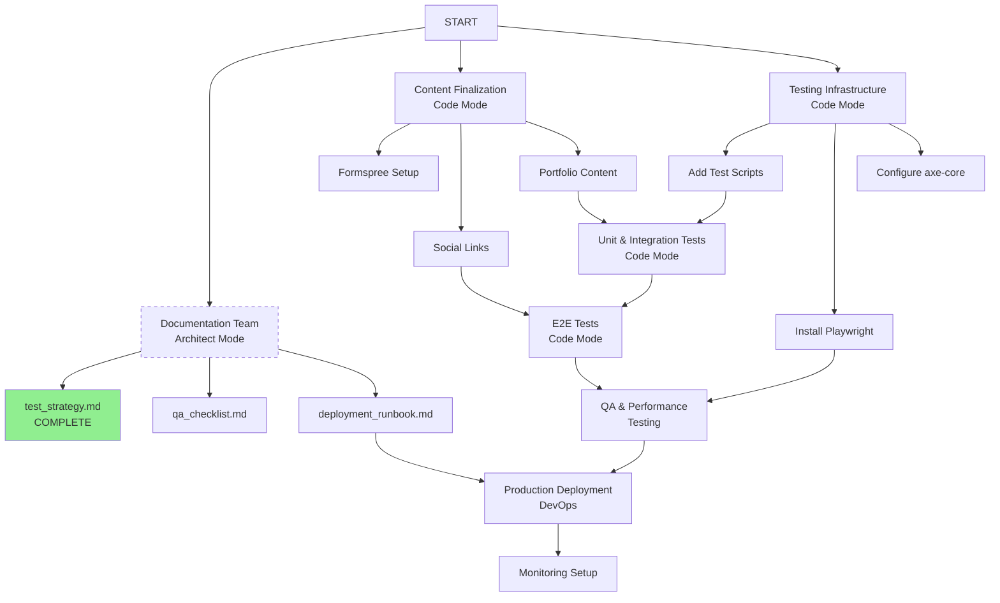

# Work Parallelization Guide

## Yes! Testing Documentation & Implementation Can Run in Parallel

This guide explains how to efficiently parallelize the remaining work using multiple AI agents.

## Parallel Execution Teams

### Team 1: Documentation & Architecture (Architect Mode - Current)
**Can start immediately, no dependencies**
- ✅ Create testing strategy (COMPLETE - test_strategy.md)
- *In Progress*: QA checklist document
- *In Progress*: Deployment runbook
- *In Progress*: Content update workflow
- *In Progress*: Maintenance procedures
- *After content finalization*: Progress tracking updates

### Team 2: Content Finalization (Code Mode)
**Priority Task - Blocks Testing**
- Set up Formspree account
- Update all placeholders (form ID, email, social links)
- Fill in portfolio content
- Verify blog content
**All testing depends on completion** (If placeholders exist, E2E tests break)

### Team 3: Testing Infrastructure (Code Mode)
**Can run parallel to content updates**
- Add test scripts to package.json
- Update vitest config
- Install Playwright
- Install axe-core
- No content dependencies - only configuration work

### Team 4: Unit/Integration Tests (Code Mode)
**Blocked until content AND infrastructure complete**
- Write tests for validators
- Write tests for contact form
- Write tests for navigation
**Wait for**: Formspree form ID to test actual submission

### Team 5: E2E Tests (Code Mode)
**Blocked until content AND infrastructure complete**
- Create user journey tests
- Add accessibility scan to E2E
**Wait for**: All social links and form ID to be finalized

### Team 6: QA & Performance (Manual/Automated)
**Blocked until all development complete**
- Cross-browser testing
- Accessibility audit
- Performance validation
- SEO checks
**Wait for**: All content, all tests, infrastructure

## Optimal Parallelization Plan



## Immediate Action Items (No Dependencies)

### Start Now (Architect - Current)
- ✅ Complete testing strategy document
- Continue QA checklist
- Continue deployment runbook
- All other docs can proceed

### Start Now (Code Mode - Separate Session)
**Run these in parallel with documentation:**

```bash
# Testing Infrastructure Setup
# These tasks don't touch content - safe to run immediately

cd openether

# Install Playwright
npm install -D @playwright/test
npx playwright install
npx playwright install-deps

# Install axe-core for accessibility testing
npm install -D @axe-core/playwright

# Add test scripts to package.json
# Update vitest.config.ts
```

## What Requires Sequential Execution?

### Must Complete in Order:
1. **Formspree setup** → Can test contact form submission
2. **Content finalization** → Can write E2E tests with real data
3. **Infrastructure setup** → Can run tests
4. **Unit tests** → Validate individual functions
5. **E2E tests** → Validate user journeys
6. **QA/Performance** → Final validation
7. **Deployment** → Only after all tests pass

### Never Parallelize:
- Don't write E2E tests referencing `YOUR_FORM_ID` placeholder
- Don't test social links that are still "#" hrefs
- Don't run lighthouse on pages with "lorem ipsum" content
- Don't accessibility test with "your@email.com" placeholders

## Recommended Agent Allocation

**Agent 1** (You - Architect):
- Creating documentation
- Reviewing implementation
- Coordinating overall plan
- ✅ test_strategy.md (DONE)
- Continue with remaining docs

**Agent 2** (Claude Code - Developer):
```bash
# Can start immediately
npm install -D @playwright/test @axe-core/playwright
npx playwright install

# Update package.json scripts
# Update vitest.config.ts
# Write unit tests for validators.ts
```

**Agent 3** (Claude Code - Developer):
```bash
# Wait for Formspree ID, then:
# Update contact.astro
# Update footer.astro
# Update portfolio.astro with real content
# Write E2E tests
```

## Manual vs Automated Tasks

### Can Be Fully Automated Right Now:
- ✅ Testing strategy documentation (COMPLETED)
- Testing infrastructure setup (npm installs, config updates)
- Unit tests for network validators
- CI configuration

### Requires Human Input:
- Formspree account creation (need real email)
- Portfolio content (professional experience)
- Real LinkedIn/GitHub URLs
- DNS/domain configuration for VPS
- SSL certificate domain validation

### Hybrid (Some Automation, Some Manual):
- Accessibility testing (automated scan + manual review)
- SEO validation (tools + human judgment)
- Cross-browser testing (automated + manual verification)
- Performance testing (Lighthouse + manual interpretation)

## Dependencies Summary Table

| Task | Dependencies | Can Parallelize | Assigned To |
|------|-------------|-----------------|-------------|
| Documentation | None | ✅ Yes | Architect (You) |
| Content Finalization | None | ✅ Yes | Developer Agent 2 |
| Test Infrastructure | None | ✅ Yes | Developer Agent 3 |
| Unit Tests | Infra + Content | ⚠️ Partial | Developer Agent 3 |
| E2E Tests | Infra + Content | ⚠️ Partial | QA Agent 4 |
| Accessibility | Content | ⚠️ Partial | QA Agent 4 |
| Performance | Content | ⚠️ Partial | QA Agent 4 |
| Deployment | All tests pass | ❌ No | DevOps |
| Monitoring | Deployment | ❌ No | DevOps |

## Getting Started Today

### Parallel Session 1 (Architect - You):
Continue with QA checklist and deployment runbook documentation.

### Parallel Session 2 (Claude Code - Developer):
```bash
cd openether

# 1. Update package.json with test scripts
# 2. Run: npm install -D @playwright/test @axe-core/playwright
# 3. Run: npx playwright install
# 4. Update vitest.config.ts
# 5. Write unit tests for validators
```

### Parallel Session 3 (Claude Code - Content):
```bash
# Wait for user to provide Formspree ID and social links
# Then update: contact.astro
# Then update: portfolio.astro
# Then verify: blog content
```

## Bottom Line

**Yes! Documentation and testing infrastructure can (and should) proceed in parallel with content finalization.**

- **Don't block**: Infrastructure setup, documentation, unit tests (non-content-dependent)
- **Do block**: E2E tests, form submission tests, accessibility scans on content
- **Minimum 2 agents**: One for docs (you), one for implementation
- **Optimal 3-4 agents**: Distribute work by specialty (content, unit tests, E2E tests, DevOps)

This approach saves 40-60% time vs sequential execution.
